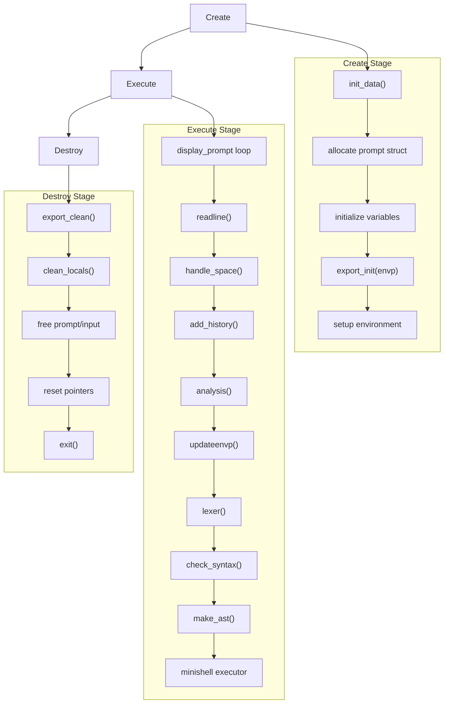
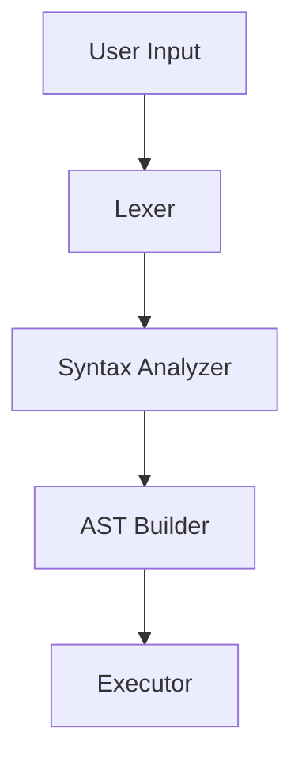
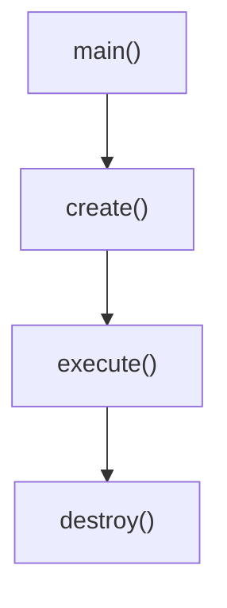
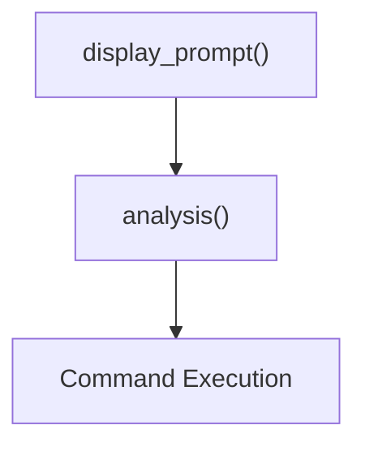
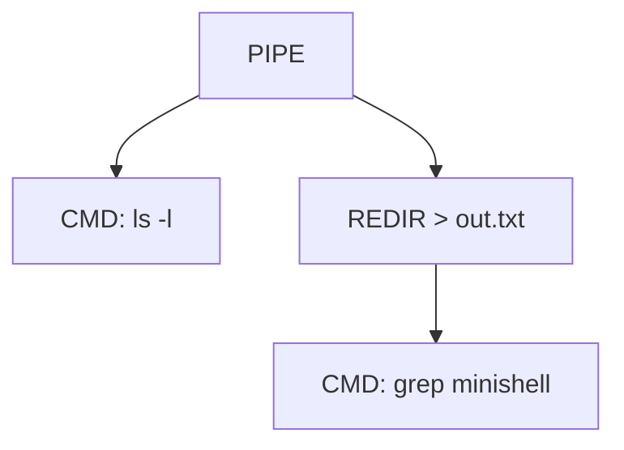
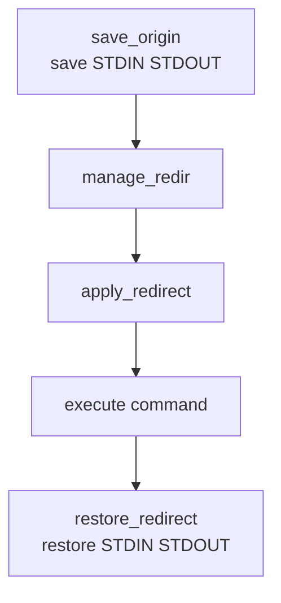

# Minishell

`Minishell` is a minimal Unix shell implemented in `C`.
The goal of the project is to understand how shells work internally by implementing parsing, process creation, and command execution.

This project is part of the curriculum of the `Ecole 42`.

## Architecture

General


The shell processes commands through mutiples stages before execution


## Program  Lifecycle



### Main

Initializes the shell instance and installs signal handlers.

### Create
Responsible for initializing the shell state.
```
init_data -> setup evironment
```
After initialization it transfers control to the execution loop.

### Execute
Handles the main shell loop.

Each user command goes through the full parsing and execution pipeline.

### Execution Engine

Commands are executed using a `AST-Based` execution model.  
Exemple:
`ls -l | grep minishell > out.txt`  
AST representation:


### Redirection Handling
Redirections are detected and applied before command execution.    

Suported operators:
```
Redirect_out: >
Append: >>
Redirect_in: <
Heredoc: <<
```
Redirections are processed by `manage_redir()` which:
- scans tokens related to the command
- opens the required file descriptors
- applies them using `dup2`
- restores original descriptors after execution

